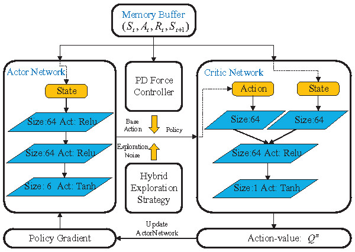

# Peg_in_hole_assembly

Our work bases on openAI baselines code espically DDPG framework.

The automatic completion of multiple peg-in-hole assembly tasks by robots remains a formidable challenge because
the traditional control strategies require a complex analysis of the contact model. 

We proposed a model-driven deep deterministic policy gradient (MDDPG) algorithm is proposed to
accomplish the assembly task through the learned policy without analyzing the contact states. 

To improve the learning efficiency, we utilize a fuzzy reward system for the complex assembly process. Then, simulations and
realistic experiments of a dual peg-in-hole assembly demonstrate the effectiveness of the proposed algorithm.

OpenAI Baselines is a set of high-quality implementations of reinforcement learning algorithms.

These algorithms will make it easier for the research community to replicate, refine, and identify new ideas, and will create good baselines to build research on top of. Our DQN implementation and its variants are roughly on par with the scores in published papers. We expect they will be used as a base around which new ideas can be added, and as a tool for comparing a new approach against existing ones. 

You can install it by typing:

```bash
git clone https://github.com/hzm2016/Peg_in_hole_assembly
cd baselines
pip install -e .
```

- [A2C](baselines/a2c)
- [ACKTR](baselines/acktr)
- [DDPG](baselines/ddpg)
- [DQN](baselines/deepq)
- [PPO](baselines/ppo1)
- [TRPO](baselines/trpo_mpi)
